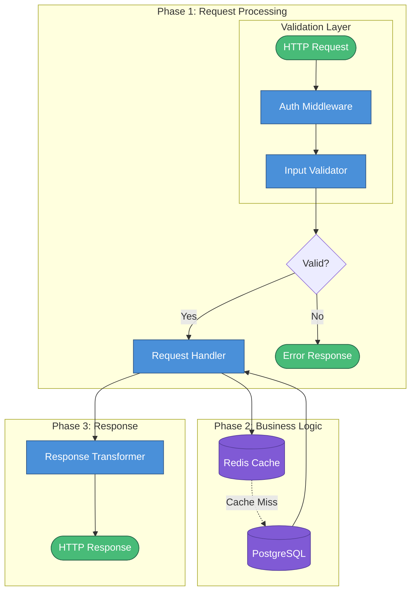

# Creating Mermaid Charts for Documentation

This workflow guides the creation of Mermaid diagrams (`.mmd` files) to visualize system architectures, data flows, and processes.

## Step 1: Understand the System

Before creating a chart, analyze the target system:
- Identify the main components (services, modules, handlers, etc.)
- Trace the data flow from input to output
- Note any component states (active vs inactive, read-only vs writable)
- Identify major processing phases or lifecycles

## Step 2: Choose the Diagram Type

| Type | Syntax | Best For |
|------|--------|----------|
| Flowchart (Top-Down) | `flowchart TD` | Complex architectures, multi-branch flows |
| Flowchart (Left-Right) | `flowchart LR` | Horizontal pipelines, timelines |
| Graph | `graph TD` | Simpler linear flows |
| Sequence | `sequenceDiagram` | API calls, request/response flows |
| Class | `classDiagram` | OOP structures, relationships |
| State | `stateDiagram-v2` | State machines, lifecycles |
| ER Diagram | `erDiagram` | Database schemas, entity relationships |

```mermaid
flowchart TD
    %% Use for complex architectures with multiple branches
```

## Step 3: Organize with Subgraphs

Group related components into subgraphs for clarity:

```mermaid
subgraph "Phase 1: Processing"
    %% Components here
end

subgraph "Component Name"
    direction TB  %% Optional: set internal direction (TB, LR, RL, BT)
    %% Component internals
end
```

**Common subgraph patterns:**
- Separate lifecycle phases (Init, Running, Cleanup)
- Group by layer (Frontend, Backend, Database)
- Isolate external services from internal modules
- Create "Details" sections for explaining complex operations

## Step 4: Define Nodes with Proper Syntax

### Node Shapes

| Shape | Syntax | Use Case |
|-------|--------|----------|
| Rectangle | `NodeId[Label]` | Standard processing blocks |
| Rounded Rectangle | `NodeId(Label)` | Soft/alternative blocks |
| Stadium | `NodeId([Label])` | Input/Output terminals |
| Circle | `NodeId((Label))` | Aggregation points, events |
| Rhombus | `NodeId{Label}` | Decision/branching points |
| Hexagon | `NodeId{{Label}}` | Preparation/setup steps |
| Parallelogram | `NodeId[/Label/]` | Input operations |
| Parallelogram (alt) | `NodeId[\Label\]` | Output operations |
| Trapezoid | `NodeId[/Label\]` | Manual operations |
| Cylinder | `NodeId[(Label)]` | Database/storage |
| Asymmetric | `NodeId>Label]` | Flags, signals |
| Subroutine | `NodeId[[Label]]` | Subroutine/predefined process |

### Label Best Practices

- Use double quotes for labels with special characters: `Node["Label with 'quotes' or (parens)"]`
- Use `<br/>` for multi-line labels: `Node["Line 1<br/>Line 2"]`
- Include data shapes when helpful: `Node["Data<br/>[Type: Array]"]`
- Mark component states: `Node["Service (Active)"]` or `Node["Cache (Read-Only)"]`

### Example Nodes

```mermaid
Input([Request])
Handler["Request Handler"]
DB[(Database)]
Cache["Cache (Read-Only)"]
Decision{Is Valid?}
Output([Response])
```

## Step 5: Define Connections

### Arrow Types

| Type | Syntax | Use Case |
|------|--------|----------|
| Solid arrow | `A --> B` | Main data flow |
| Dotted arrow | `A -.-> B` | Optional paths, async calls |
| Thick arrow | `A ==> B` | Primary/important flow |
| Labeled arrow | `A -->|"Label"| B` | Describe transformation |
| Bidirectional | `A <--> B` | Two-way communication |

### Connection Patterns

```mermaid
%% Standard flow
Input --> Handler --> Output

%% Optional/async path (use dotted line)
Handler -.-> Logger

%% Labeled transformation
Raw -->|"Validate"| Validated

%% Multiple inputs to one node
ServiceA & ServiceB --> Aggregator

%% Multiple outputs
Router --> ServiceA
Router --> ServiceB
```

## Step 6: Add Styling

Apply styles to highlight different component types:

```mermaid
%% Define style classes
classDef primary fill:#4a90d9,stroke:#2c5282,color:#fff;
classDef secondary fill:#48bb78,stroke:#276749,color:#fff;
classDef warning fill:#ed8936,stroke:#c05621,color:#fff;
classDef danger fill:#fc8181,stroke:#c53030,color:#fff;
classDef inactive fill:#e2e8f0,stroke:#a0aec0,color:#4a5568;
classDef storage fill:#805ad5,stroke:#553c9a,color:#fff;

%% Apply classes to nodes
class InputNode,OutputNode primary
class Handler secondary
class DB storage
class Deprecated inactive
```

Or apply inline styles:

```mermaid
style NodeId fill:#4a90d9,stroke:#2c5282,stroke-width:2px
style NodeId2 fill:#e2e8f0,stroke:#a0aec0,stroke-dasharray: 5 5
```

**Recommended Color Palette:**

| Component Type | Fill Color | Stroke Color | Text Color |
|----------------|------------|--------------|------------|
| Primary/Active | `#4a90d9` | `#2c5282` | `#fff` |
| Success/Complete | `#48bb78` | `#276749` | `#fff` |
| Warning/Caution | `#ed8936` | `#c05621` | `#fff` |
| Error/Danger | `#fc8181` | `#c53030` | `#fff` |
| Inactive/Disabled | `#e2e8f0` | `#a0aec0` | `#4a5568` |
| Storage/Database | `#805ad5` | `#553c9a` | `#fff` |
| External Service | `#667eea` | `#434190` | `#fff` |

## Step 7: Add Comments

Use `%%` for comments to explain complex parts:

```mermaid
%% ============================================================
%% PHASE 1: REQUEST HANDLING
%% ============================================================

%% Authentication Layer (handled by middleware)
Auth["Auth Middleware"]
```

## Complete Example Template



## Step 8: Save and Validate

1. Save the file with `.mmd` extension
2. Test rendering in:
   - [Mermaid Live Editor](https://mermaid.live)
   - VS Code with Mermaid extension
   - GitHub (renders `.mmd` in preview)
3. Common syntax errors to avoid:
   - Missing quotes around labels with special characters
   - Unclosed subgraphs
   - Invalid node IDs (avoid spaces, use underscores)
   - Duplicate node IDs

## Troubleshooting Common Errors

| Error | Cause | Fix |
|-------|-------|-----|
| `Parse error ... got 'STR'` | Unquoted special chars in label | Wrap label in double quotes |
| `Parse error ... got 'STYLE_SEPARATOR'` | Colon in unquoted label | Wrap label in double quotes |
| `Parse error ... got 'PS'` | Parentheses in unquoted label | Wrap label in double quotes |
| Node not rendering | Invalid characters in node ID | Use alphanumeric + underscore only |
| Subgraph not showing | Missing `end` keyword | Add `end` after subgraph content |
| Arrow not rendering | Space in arrow syntax | Use `-->` not `-- >` |
